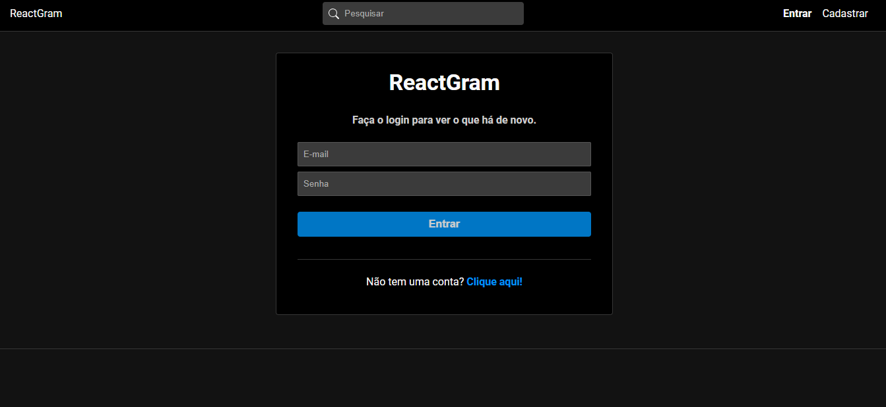
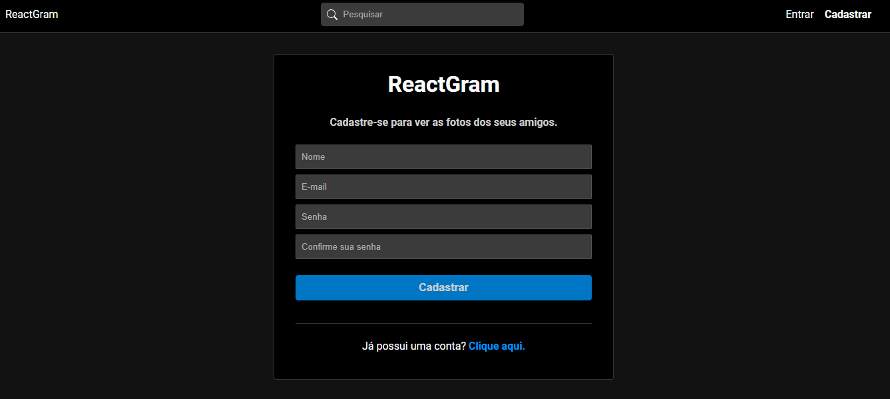
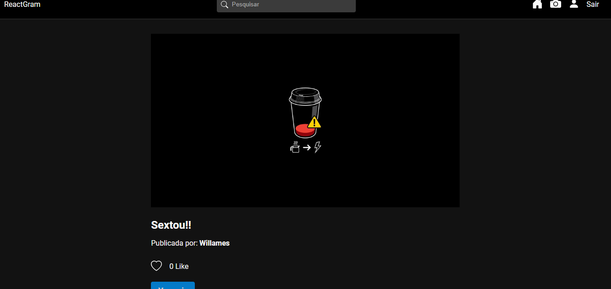
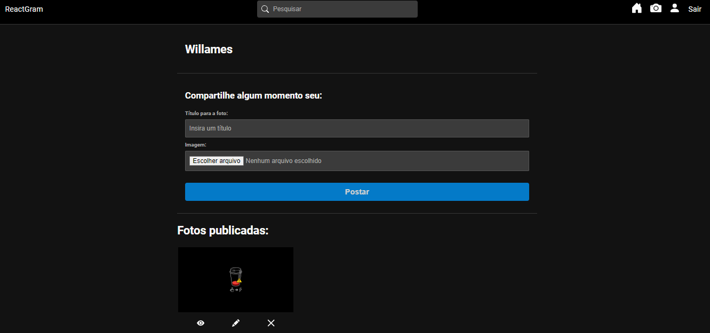
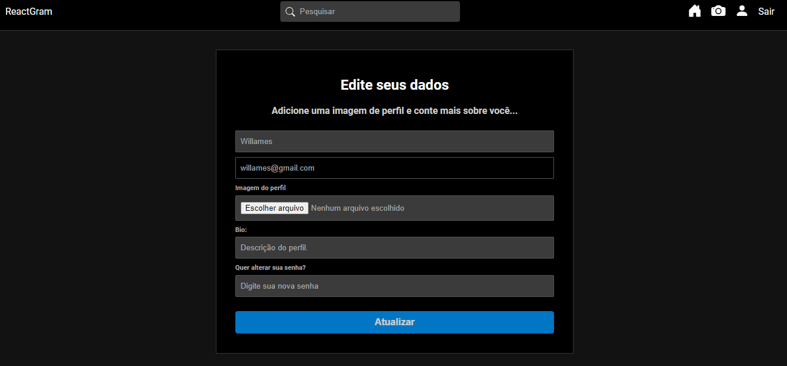

# ReactGram

Rede social para compartilhamento de fotos, podendo publicar, excluir suas fotos, comentar e curtir fotos compartilhadas na aplicação.
Após criar seu perfil com suas informações é possível compartilhar e interagir nas publicações.

### Tecnologias

- React.JS
- React-router
- Redux toolkit
- React-icons
- Node.JS
- MongoDB Atlas
- Express

### Após clonar o repositório

Acesse a pasta server e execute:

- `npm install` para instalar as dependências
- `npm run server` para subir o servidor
- É necessário criar um cluster no mongodb atlas e configurar as variáveis de ambiente
- É mecessário acessar a pasta config e no arquivo db.js adcionar o endereço do cluster

Acesse a pasta client e execute:

- `npm install` para instalar as dependências
- `npm run dev` para subir a aplicação

